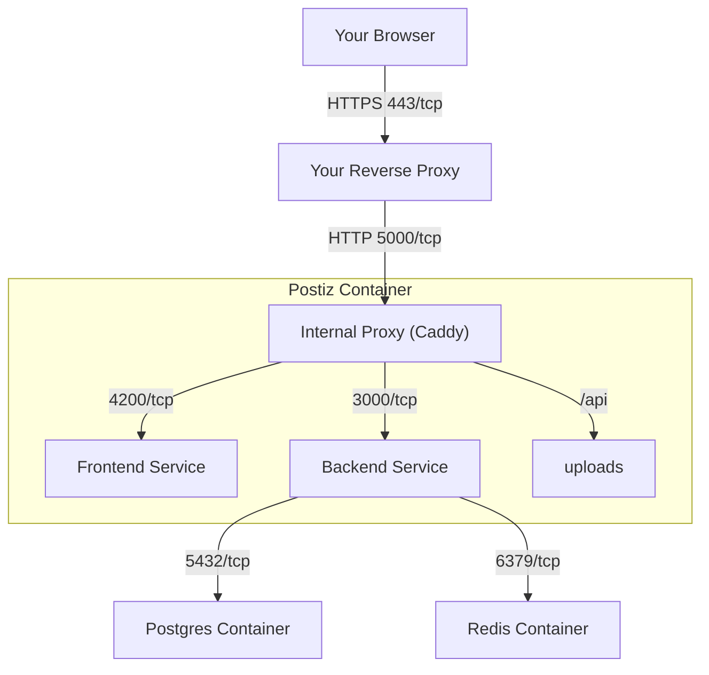

## Installation Prerequisites

This section will ask you to install & configure several services exaplained below.

### Network Requirements

#### HTTPS is required (or localhost)

Postiz marks it's login cookies as Secure, this is called “secure context” in modern web browsers.

If you want to use an secure Login Process, you need to set up an Certificate, which can be done via Reverse Proxy like Caddy or Nginx.

If you cannot use a certificate (HTTPS), add the following environment variable to your `.env` file:
```env
NOT_SECURED=true
```
**Security Warning**: Setting `NOT_SECURED=true` disables secure cookie requirements. This should only be used in development environments or when you fully understand the security implications. Not recommended for production use.

#### Network Ports

- **5000/tcp**: for a single **single entry point** for postiz when running in a container. This is the one port your reverse proxy should talk to.
- **4200/tcp**: for the **Frontend** service (the web interface). Most users **do not** need to expose this port publicly.
- **3000/tcp**: for the **Backend** service (the API). Most users **do not** need to expose this port publicly.
- **5432/tcp**: for the **Postgres** container. Most users **do not** need to expose this port publicly.
- **6379/tcp**: for the **Redis** container. Most users **do not** need to expose this port publicly.

If you are using docker images, we recommend just exposing port 5000 to your external proxy. This will reduce the likelihood of misconfiguration, and make it easier to manage your network.


