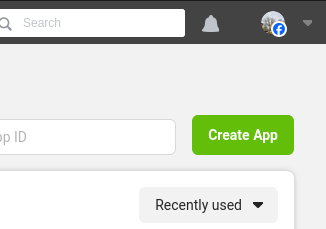
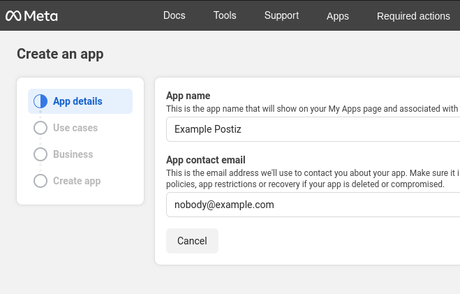
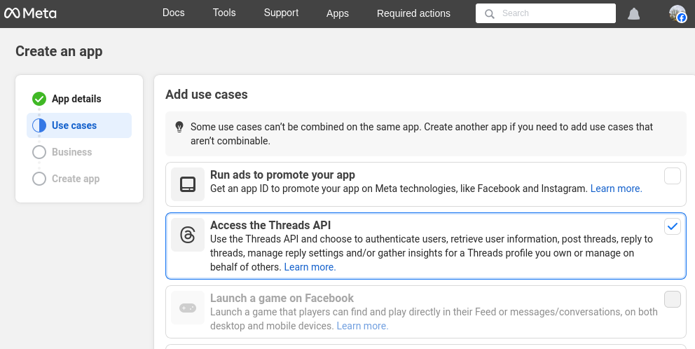
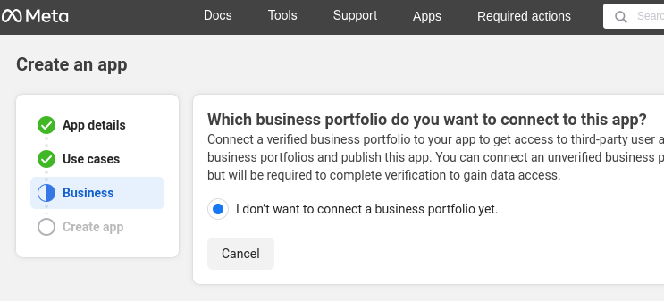
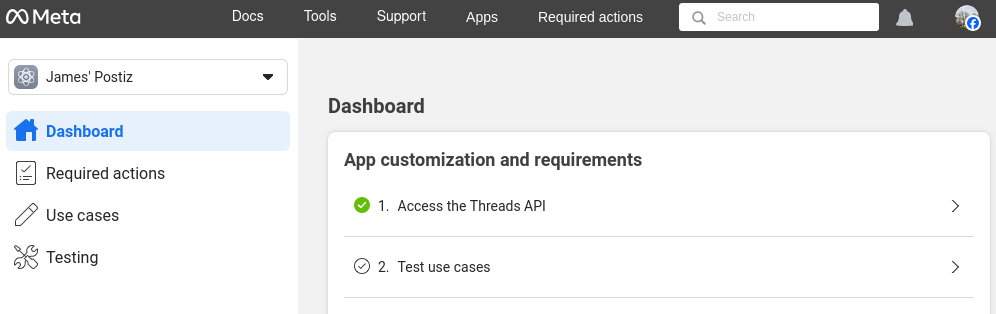
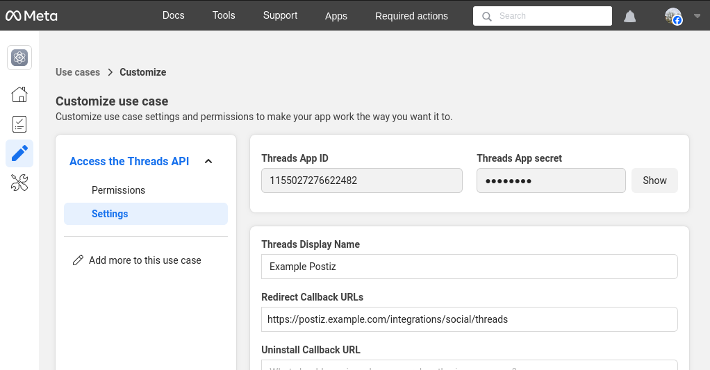
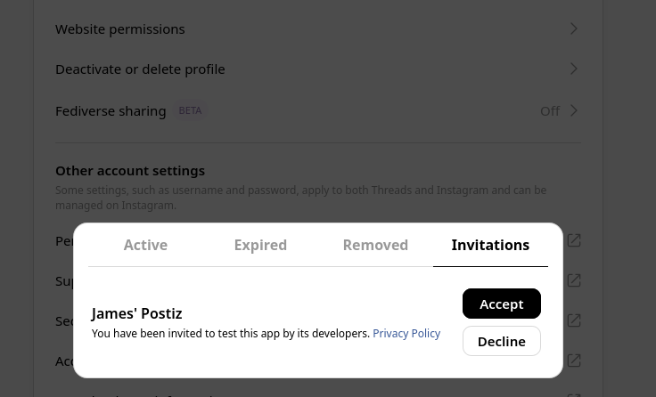
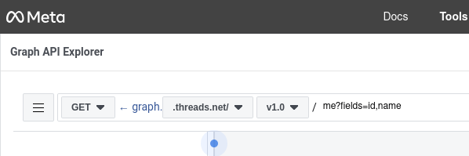

import {Steps, Callout} from "nextra/components";
import OAuth2Redirect from "../../components/snippets/oauth2redirect.tsx";

<Callout>
This integration requires that you have setup a Facebook developer account already. You can start by going to the [Meta/Facebook Developer Portal](https://developers.facebook.com/apps).

This is a complex integration, and it may take some time to get it right. If you have any issues, please reach out to us on the Postiz Discord. This documentation is not fully complete, because at the time of writing the Threads API seems like it's having issues. This page was written to get something up to get you started.
</Callout>

<Steps>
### Create an app

Go to the [Meta/Facebook Developer Portal](https://developers.facebook.com/apps) and click on "Create app".

### Give your app a name and email

### Request access to Threads

Select *Access the Threads API*.

### Add business details, or skip

### Finish creating the app

You should not have any extra requirements to publish and maintain access.

### Configure API access

On the app dashboard, Select "Access the Threads API" to begin customizing the API access.

Add the "threads_content_publish" and "threads_basic" (automatically selected) to your app.

### Set threads API settings

* Click the "Settings" tab. Copy your "Threads App ID", and set the postiz environment variables `THREADS_APP_ID` to this value.
* Click the "Show" button next to the Threads App Secret, and set the postiz environment variable `THREADS_APP_SECRET` to this value. Note that the next box is quite small, make sure you scroll across the copy the full value. It should be 32 characters long.

<OAuth2Redirect provider = "threads" />

** Note that you have to "click" the URL to make it active, otherwise the form will not save.
** You can use the same value for the **Uninstall Callback URL** and **Delete Callback URL**, but note that Postiz does not support either at this time. The form will not save unless you enter something.

Go back to the 'Dashboard' view of the Facebook developers portal, click "Finish customization" sure you click through the setup wizard to finish the step "Yes I'm finished" to complete the setup. The AP may not work until you've done this. Ignore "Test use cases" for now as it will not work until you have created a test user (see later).

### Restart Postiz

Stop Postiz if it is running, and then start it again to pick up the new environment variables.

You should not try to add a Threads account to Postiz at this time.

### Add the Threads account as a tester 

* In the sidebar go to "App roles" -> "roles". 
* Select the "Testers" tab. Click "Add People". 
* Under *Additional Roles for this App*, select *Threads Tester*.
* Enter usernames of the threads users you want to test the app. Probably your own username. Note that this is probably different from your Meta developers account which is tied to Facebook.

### Allow the app on your threads account

* On threads.net, open your account settings; https://www.threads.net/settings/account
* Open *Website permissions*, and switch to the *Invitations* tab;
* If all has gone well, you should have a pending invite. Accept that invite.

### Start testing

* Go back to the Meta developers portal, and in the sidebar, click *Testing*, and then open the *Open Graph API Explorer*. 
* In the header, dropdown the API selector and change it to threads.net v1. 

* In the right sidebar, under *Access Token*, click *Generate Threads Access Token*. This will open a new window where you can select the Threads account you want to test with - it should be an account that accepted the earlier invite. If everything has worked successfully you should be provided with a very long alphanumeric access token - you do not need to do anything with this, but it proves things are working correctly.

### ...Good luck!

At this stage things should be working correctly, try a test post from Postiz to confirm. 

This is a complex integration, and it may take some time to get it right. If you have any issues, please reach out to us on the Postiz Discord.

</Steps>
